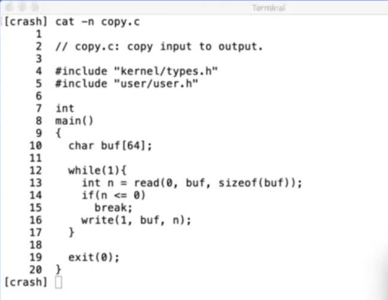
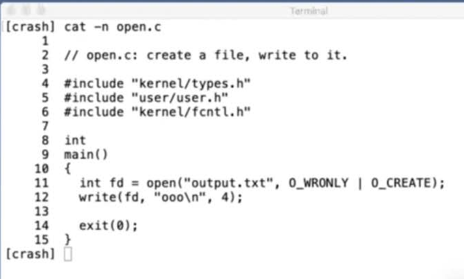
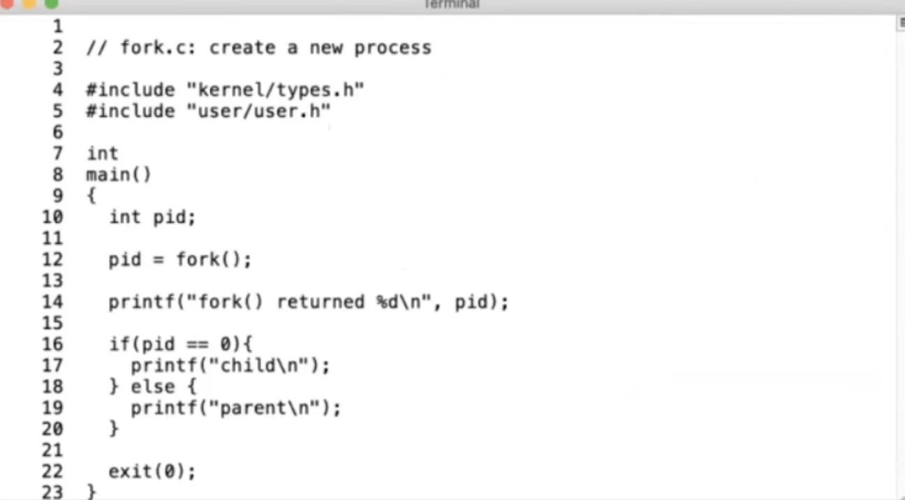
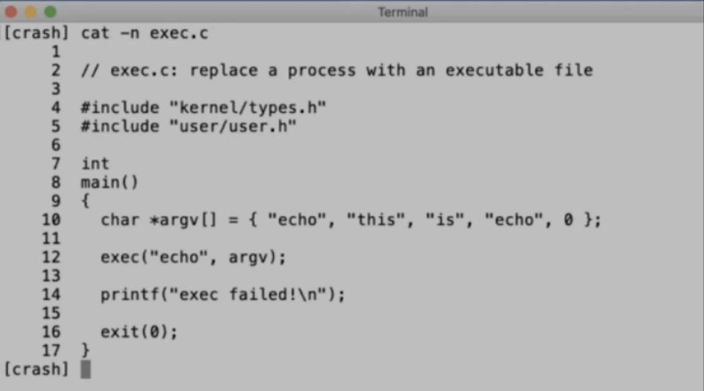
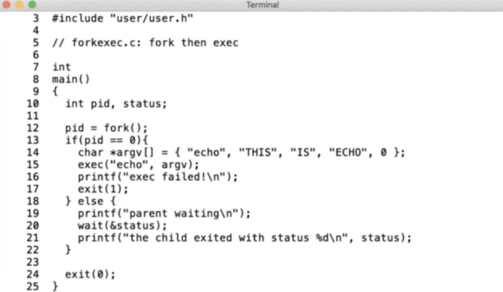
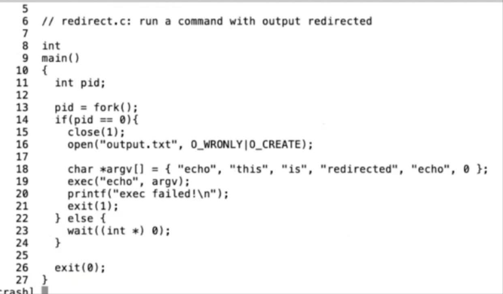

# Lesson 1: Introduction

- [Lesson 1: Introduction](#lesson-1-introduction)
  - [Overview](#overview)
    - [6.S081 Goals](#6s081-goals)
    - [What is the Purpose of an O/S?](#what-is-the-purpose-of-an-os)
    - [Organization: Layered Picture](#organization-layered-picture)
    - [What Services Does an O/S Kernel Typically Provide?](#what-services-does-an-os-kernel-typically-provide)
    - [What's the Application / Kernel Interface (API)?](#whats-the-application--kernel-interface-api)
    - [Why is O/S Design and Implementation Hard and Interesting?](#why-is-os-design-and-implementation-hard-and-interesting)
    - [You'll be Glad You Took This Course If You](#youll-be-glad-you-took-this-course-if-you)
  - [Class Structure](#class-structure)
    - [Online Course Information](#online-course-information)
    - [Lectures](#lectures)
    - [Labs](#labs)
  - [Introduction to UNIX System Calls](#introduction-to-unix-system-calls)
    - [Applications See the O/S via System Calls; that Interface Will be a Big Focus](#applications-see-the-os-via-system-calls-that-interface-will-be-a-big-focus)
    - [I'll Show Some Examples, and Run Them on xv6](#ill-show-some-examples-and-run-them-on-xv6)
    - [Example: `copy.c`, Copy Input to Output](#example-copyc-copy-input-to-output)
    - [Example: `open.c`, Create a File](#example-openc-create-a-file)
    - [What Happens When a Program Calls a System Call Like `open()`?](#what-happens-when-a-program-calls-a-system-call-like-open)
    - [I've Been Typing to UNIX's Command-line Interface, the Shell](#ive-been-typing-to-unixs-command-line-interface-the-shell)
    - [Example: `fork.c`, Create a New Process](#example-forkc-create-a-new-process)
    - [Example: `exec.c`, Replace Calling Process with an Executable File](#example-execc-replace-calling-process-with-an-executable-file)
    - [Example: `forkexec.c`, Fork() a New Process, Exec() a Program](#example-forkexecc-fork-a-new-process-exec-a-program)
    - [Example: `redirect.c`, Redirect the Output of a Command](#example-redirectc-redirect-the-output-of-a-command)
    - [It's Worth Asking "Why" About Design Decisions](#its-worth-asking-why-about-design-decisions)
    - [Example: `pipe1.c`, Communicate Through a Pipe](#example-pipe1c-communicate-through-a-pipe)
    - [Example: `pipe2.c`, Communicate Between Processes](#example-pipe2c-communicate-between-processes)
    - [Example: `list.c`, List Files in a Directory](#example-listc-list-files-in-a-directory)
  - [Summary](#summary)

## Overview

### 6.S081 Goals

- Understand operating system (O/S) design and implementation
- Hands-on experience extending a small O/S (xv6 here)
- Hands-on experience writing systems software

### What is the Purpose of an O/S?

- **Abstract** the hardware for convenience and portability
- **Multiplex** the hardware among many applications
- **Isolate** applications in order to contain bugs
- Allow **sharing** among cooperating applications
- Control sharing for **security**
- Don't get in the way of **high performance**
- Support a **wide range** of applications

### Organization: Layered Picture

- User applications: vi, gcc, DB, &c
- Kernel services: File system
- Hardware: CPU, RAM, disk, net, &c
  - We care a lot about the **interfaces between User applications and Kernel services** and **internal kernel structure**

### What Services Does an O/S Kernel Typically Provide?

- Process (a running program)
- Memory allocation
- File contents
- File names, directories
- Access control (security)
- Many others: users, IPC, network, time, terminals

### What's the Application / Kernel Interface (API)?

- "System calls"
- Examples, in C, from UNIX (e.g. Linux, macOS, FreeBSD):

  ```c
  fd = open("out", 1); // fd means 'file descriptor'
  write(fd, "hello\n", 6);
  pid = fork(); // pid means 'process identifier'
  ```

- These look like function calls but they aren't

### Why is O/S Design and Implementation Hard and Interesting?

- Unforgiving environment: quirky hardware, hard to debug
- Many design tensions:
  - Efficient vs Abstract/Portable/General-Purpose
  - Powerful vs Simple Interfaces
  - Flexible vs Secure
- Features interact: `fd = open(); fork()`
- Uses are varied: laptops, smartphones, cloud, virtual machines, embedded
- Evolving hardware: NVRAM, multi-core, fast networks

### You'll be Glad You Took This Course If You

- Care about what goes on under the hood
- Like infrastructure
- Need to track down bugs or security problems
- Care about high performance

## Class Structure

### Online Course Information

- [6.S081 course page](https://pdos.csail.mit.edu/6.S081/)
  - Schedule, lectures, assignments, labs
- Piazza
  - Announcements, discussion, lab help

### Lectures

- O/S ideas
- Case study of xv6, a small O/S, via code and xv6 book
- Lab background
- O/S papers
- Submit a question about each reading, before lecture

### Labs

- The point: hands-on experience
- Mostly one week each
- Three kinds:
  - Systems programming (due next week...)
  - O/S primitives, e.g. thread switching
  - O/S kernel extensions to xv6, e.g. network
- Use Piazza to ask/answer lab questions
- Discussion is great, but please do not look at others' solutions!

## Introduction to UNIX System Calls

### Applications See the O/S via System Calls; that Interface Will be a Big Focus

- Let's start by looking at how programs use system calls
- You'll use these system calls in the first lab
- And extend and improve them in subsequent labs

### I'll Show Some Examples, and Run Them on xv6

- xv6 has a similar structure to UNIX systems such as Linux
  - But much simpler -- you'll be able to digest all of xv6
  - The accompanying book explains how xv6 works, and why
- Why UNIX?
  - Open source, well documented, clean design, widely used
  - Studying xv6 will help if you ever need to look inside Linux
- xv6 has two roles in 6.S081:
  - Example of core functions: virtual memory, multi-core, interrupts, &c
  - Starting point for most of the labs
- xv6 runs on RISC-V, as in current 6.004
- You'll run xv6 under the QEMU machine emulator

### Example: `copy.c`, Copy Input to Output

- Read bytes from input, write them to the output
- `$ copy`
- `copy.c` is written in C
  - Kernighan and Ritchie (K&R) book is good for learning C
- You can find these example programs via the schedule on the website

- `read()` and `write()` are system calls
- **First** `read()`/`write()` argument is a "file descriptor" (fd)
  - Passed to the kernel to tell it which "open file" to read/write
  - Must previously have been opened
  - An FD connects to a file/device/socket/&c
  - A process can open many files, have many FDs
  - UNIX convention: **fd 0 is "standard input", 1 is "standard output"**
- **Second** `read()` argument is **a pointer to some memory into which to read**
- **Third** argument is the **maximum number of bytes to read**
  - `read()` may read less, but not more
- Return value: number of bytes actually read, or -1 for error
- Note: `copy.c` does not care about the format of the data
  - UNIX I/O is 8-bit bytes
  - Interpretation is application-specific, e.g. database records, C source, &c
- Where do file descriptors come from?

### Example: `open.c`, Create a File



- `$ open`
- `$ cat output.txt`
- `open()` creates a file, returns a file descriptor (or -1 for error)
- FD is a small integer
- FD indexes into a per-process table maintained by the kernel
- Different processes have different FD name-spaces
  - i.e. FD 1 often means different things to different processes
- These examples ignore errors -- don't be this sloppy!
- Figure 1.2 in the xv6 book lists system call arguments/return
  - Or look at UNIX man pages, e.g. `man 2 open`

### What Happens When a Program Calls a System Call Like `open()`?

- Looks like a function call, but it's actually a **special instruction**
- Hardware **saves** some user registers
- Hardware **increases** privilege level
- Hardware **jumps to** a known "entry point" in the kernel
- Now running C code in the kernel
- Kernel calls system call implementation
  - `open()` looks up name in file system
  - It might wait for the disk
  - It updates kernel data structures (cache, FD table)
- **Restore** user registers
- **Reduce** privilege level
- **Jump back to** calling point in the program, which resumes
- We'll see more detail later in the course

### I've Been Typing to UNIX's Command-line Interface, the Shell

- The shell prints the "$" prompts
- The shell lets you run UNIX command-line utilities
  - Useful for system management, messing with files, development, scripting
  - `$ ls`
  - `$ ls > out`
  - `$ grep x < out`
- UNIX supports other styles of interaction too
  - Window systems, GUIs, servers, routers, &c
- But time-sharing via the shell was the original focus of UNIX
- We can exercise many system calls via the shell

### Example: `fork.c`, Create a New Process



- The shell creates a new process for each command you type, e.g. for
  - `$ echo hello`
- The `fork()` system call creates a new process
  - `$ fork`
- The kernel makes a copy of the calling process
  - Instructions, data, registers, file descriptors, current directory
  - "Parent" and "child" processes
- Only difference: `fork()` returns a pid in parent, 0 in child
- A pid (process ID) is an integer, kernel gives each process a different pid
- Thus:
  - `fork.c`'s "fork() returned" executes in *both* processes
  - The `if(pid == 0)` allows code to distinguish
- Ok, fork lets us create a new process
  - How can we run a program in that process?

### Example: `exec.c`, Replace Calling Process with an Executable File



- How does the shell run a program, e.g.
  - `$ echo a b c`
- A program is stored in a file: instructions and initial memory
  - Created by the compiler and linker
- So there's a file called `echo`, containing instructions
- `$ exec`
- `exec()` replaces current process with an executable file
  - Discards instruction and data memory
  - Loads instructions and memory from the file
  - Preserves file descriptors
- `exec(filename, argument-array)`
  - Argument-array holds command-line arguments; exec passes to `main()`
  - `cat user/echo.c`
  - `echo.c` shows how a program looks at its command-line arguments

### Example: `forkexec.c`, Fork() a New Process, Exec() a Program



- `$ forkexec`
- `forkexec.c` contains a common UNIX idiom:
  - `fork()` a child process
  - `exec()` a command in the child
  - Parent `wait()`s for child to finish
- The shell does `fork`/`exec`/`wait` for every command you type
  - After `wait()`, the shell prints the next prompt
  - To run in the background -- `&` -- the shell skips the wait()
- `exit(status)` -> `wait(&status)`
  - Status convention: 0 = success, 1 = command encountered an error
- Note: the `fork()` copies, but `exec()` discards the copied memory
  - This may seem wasteful
  - You'll transparently eliminate the copy in the "copy-on-write" lab

### Example: `redirect.c`, Redirect the Output of a Command



- What does the shell do for this?
  - `$ echo hello > out`
- Answer: `fork`, change FD 1 in child, `exec echo`
- `$ redirect`
- `$ cat output.txt`
- Note: `open()` always chooses lowest unused FD; 1 due to `close(1)`
- `fork`, FDs, and `exec` interact nicely to implement I/O redirection
  - Separate `fork`-then-`exec` give child a chance to change FDs before `exec`
  - FDs provide indirection
    - Commands just use FDs 0 and 1, don't have to know where they go
  - `exec` preserves the FDs that sh set up
- Thus: only `sh` has to know about I/O redirection, not each program

### It's Worth Asking "Why" About Design Decisions

- Why these I/O and process abstractions? Why not something else?
- Why provide a file system? Why not let programs use the disk their own way?
- Why FDs? Why not pass a filename to `write()`?
- Why are files streams of bytes, not disk blocks or formatted records?
- Why not combine `fork()` and `exec()`?
- The UNIX design works well, but we will see other designs!

### Example: `pipe1.c`, Communicate Through a Pipe

- How does the shell implement
  - `$ ls | grep x`
- `$ pipe1`
- An FD can refer to a "pipe", as well as a file
- The `pipe()` system call creates two FDs
  - Read from the first FD
  - Write to the second FD
- The kernel maintains a buffer for each pipe
  - `write()` appends to the buffer
  - `read()` waits until there is data

### Example: `pipe2.c`, Communicate Between Processes

- Pipes combine well with `fork()` to implement `ls | grep x`
  - Shell creates a pipe,
  - Then forks (twice),
  - Then connects `ls`'s FD 1 to pipe's write FD,
  - And `grep`'s FD 0 to the pipe
- `$ pipe2` -- a simplified version
- Pipes are a separate abstraction, but combine well with `fork()`

### Example: `list.c`, List Files in a Directory

- How does `ls` get a list of the files in a directory?
- You can open a directory and read it -> file names
- `.` is a pseudo-name for a process's current directory
- See `ls.c` for more details

## Summary

- We've looked at UNIX's I/O, file system, and process abstractions.
- The interfaces are simple -- just integers and I/O buffers.
- The abstractions combine well, e.g. for I/O redirection.
